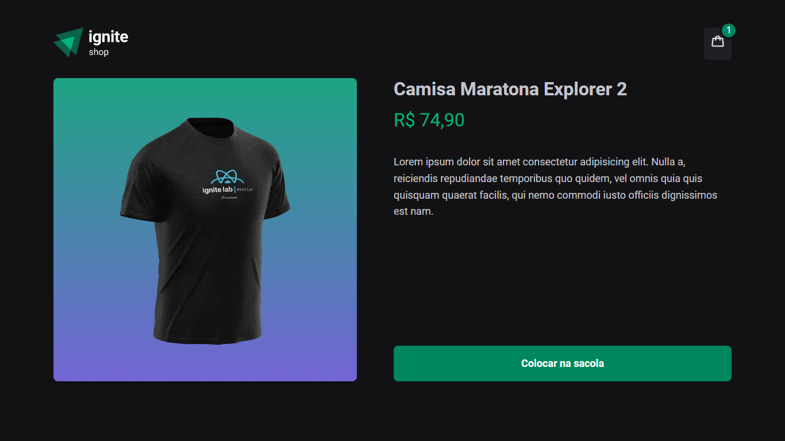
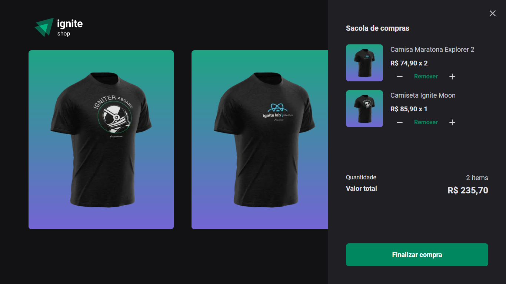
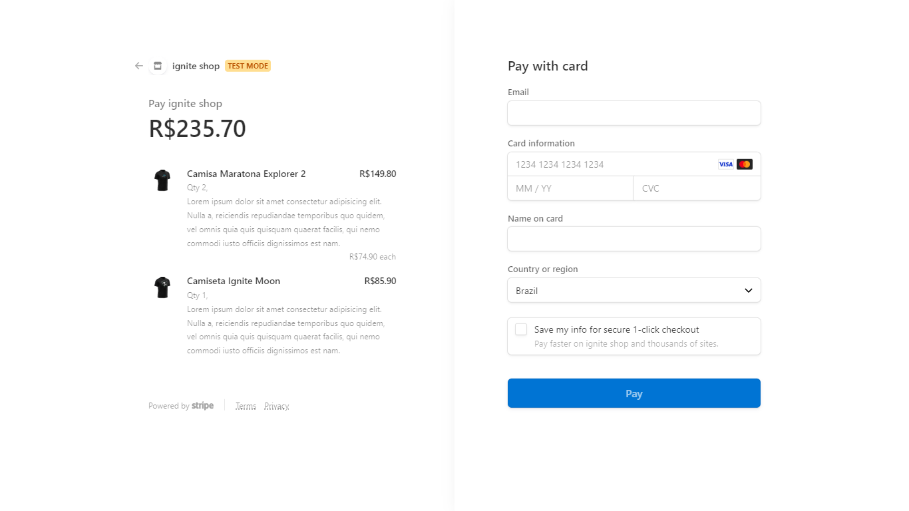
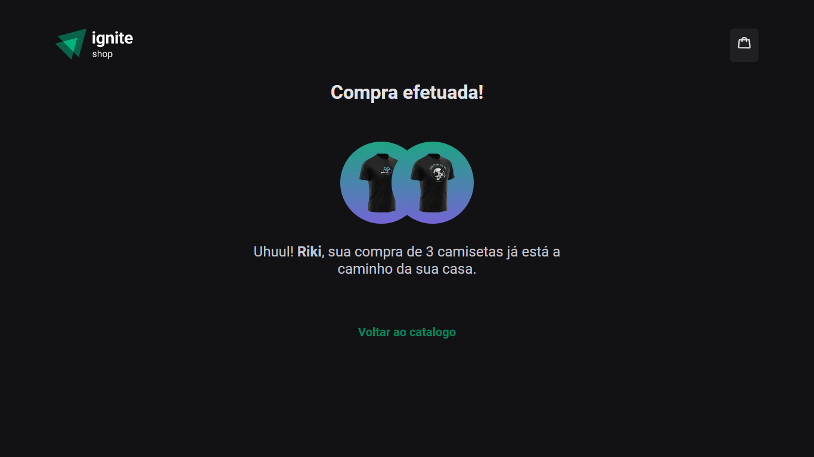
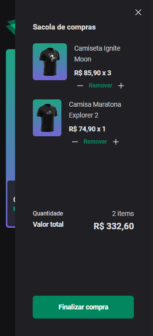
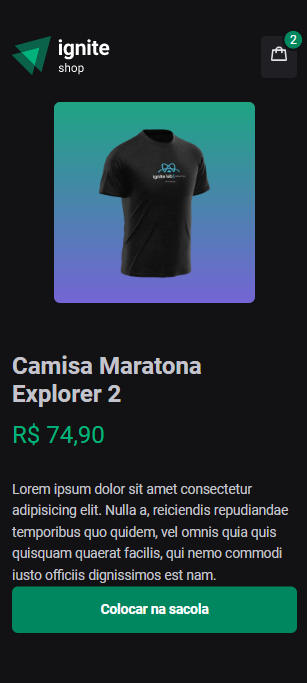
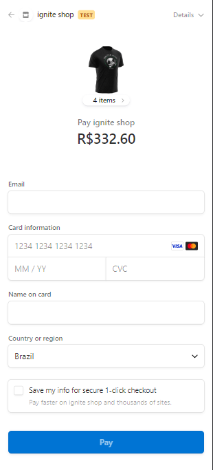
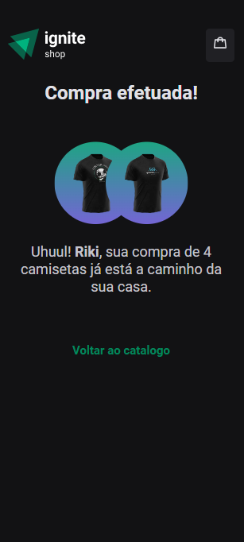

# Ignite Shop 2.0 - React JS

Ignite Shop 2.0 is an online store that sells shirts.

## Technolages used
* ReactJs
* NextJs
* TypeScript
* Axios
* CSS (Stitches)
* Stripe
* Keen Slider

## Explanation

The data about the products (shirts) come from [Stripe API](https://stripe.com/en-br "Stripe home page"). All the products are listed on the home page.
Also, there is a page for each product. It shows the image, name, description and price.
To do the cart, **ContextAPI** was used. It saves the chosen products and calculate the total. Also, the user can increase or decrease the quantity of each product in the cart.

## Pages ScreenShots
### Desktop

| Home | Produto |
| --- | --- |
|  |  | 

| Carrinho | Checkout | Sucesso |
| --- | --- | --- |
|  |  | 

### Mobile:

| Home | Carrinho | Produto | Checkout |  Sucesso |
| --- | --- | --- | --- | --- |
|  |  |  |  | 

## How can I use it?

### First
Check if you have the node and npm (comes with node) installed in your machine. To check, you must go to your terminal or command prompt and type:
> node -v

> npm -v

If shows the version, you are good to go. If not, go to https://nodejs.org/en/ and install the LTS version (it will install both node and npm).

### Second

If you don't have an IDE, install one of you preference. In my case, I used Visual Studio Code.

### third

Make an account at stripe or log into your account. Make a store and put some products. You will need the public and secret key that you can find after you do the store inside Stripe.

### Fourth

You clone the project. Use the commande line on your folder:
 > git clone https://github.com/Vinicius-PR/Challenge-04-Ignite-2022-Ignite-Shop-2.0.git
 
 ### Fiveth
 
Open the folder using your IDE. Then, go to the terminal of your IDE and type the following command to install the dependencies: (or can go to the folder application using normal terminal and type the same command)
 > npm install
 
 ### Finally
 
Type the next command to start the aplication:
 > npm run dev
